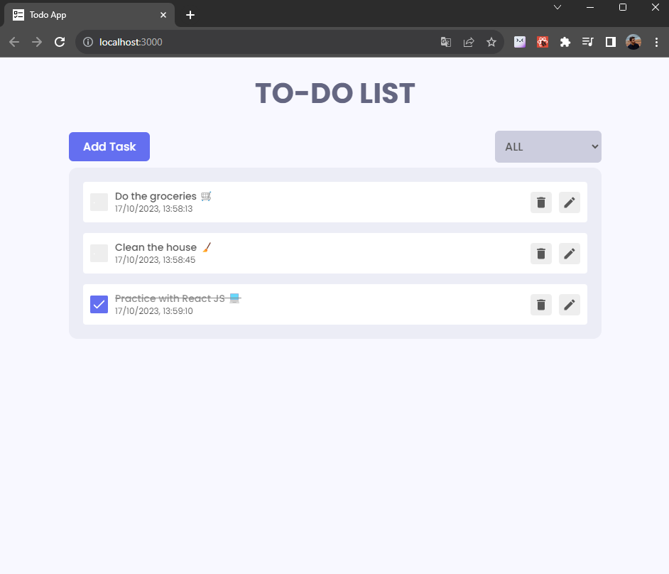

# React JS To-do App
The idea of this project was making a simple web application using React JS to get familiar with this framework. 

This app consists in a list of To-do tasks, with a title and status. All tasks created will be displayed at the main page, from where you can create new tasks, update and delete existing ones.

<div align="center">
  
</div>

## Running the application
To run the application you only need to install the project dependencies with the command:
```shell
npm install
```

and after that start the server with:

```shell
npm start
```

The app will open in your browser in http://localhost:3000

## References
This project is based in [React Todo App project, from ShaifArfan](https://github.com/ShaifArfan/react-todo-app).
